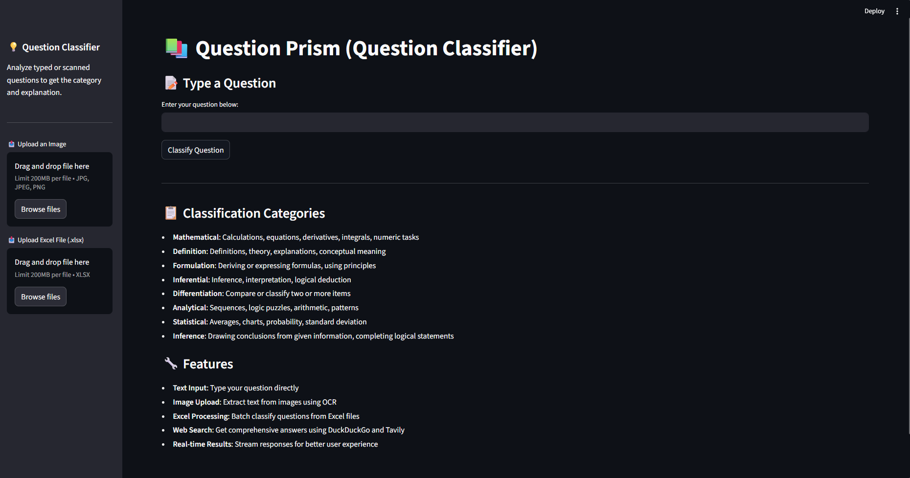
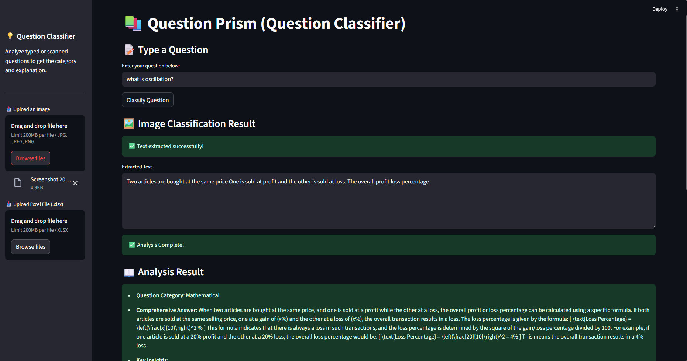
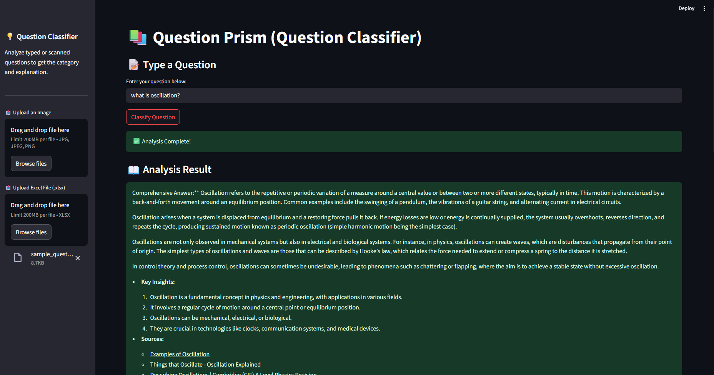

# 📚 Question Prism - Question Classifier

An intelligent question classification system powered by CrewAI and Streamlit that automatically categorizes questions into predefined types using advanced AI agents.



## 📸 Demo Screenshots

| Image Classification |Text Processing |
|-------------------|------------------|
|  |  |

## 🚀 Features

- **Text Input Classification**: Directly type questions for instant classification
- **OCR Image Processing**: Extract and classify questions from uploaded images
- **Excel Batch Processing**: Process multiple questions from Excel files simultaneously
- **Real-time Streaming**: Get results with smooth, typewriter-style response streaming
- **Multiple Classification Categories**: Supports 8 different question types
- **Web Search Integration**: Enhanced answers using DuckDuckGo and Tavily APIs
- **Downloadable Results**: Export classification results as CSV files

## 📋 Classification Categories

The system classifies questions into the following categories:

- **Mathematical**: Calculations, equations, derivatives, integrals, numeric tasks
- **Definition**: Definitions, theory, explanations, conceptual meaning
- **Formulation**: Deriving or expressing formulas, using principles
- **Inferential**: Inference, interpretation, logical deduction
- **Differentiation**: Compare or classify two or more items
- **Analytical**: Sequences, logic puzzles, arithmetic, patterns
- **Statistical**: Averages, charts, probability, standard deviation
- **Inference**: Drawing conclusions from given information, completing logical statements

## 🛠️ Technology Stack

- **Frontend**: Streamlit
- **AI Framework**: CrewAI
- **OCR**: Custom OCR implementation
- **Data Processing**: Pandas
- **Containerization**: Docker & Docker Compose
- **APIs**: OpenAI, Tavily

## 📁 Project Structure

```
question-classifier/
├── app/
│   ├── main.py                 # Main Streamlit application
│   └── utils/
│       ├── ocr.py             # OCR text extraction utilities
│       └── cordination.py     # CrewAI agent coordination
├── logs/                      # Application logs
├── uploads/                   # File upload storage
├── requirements.txt           # Python dependencies
├── Dockerfile                 # Docker configuration
├── docker-compose.yml         # Docker Compose setup
├── .env                       # Environment variables (create this)
└── README.md                  # This file
```

## 🚦 Quick Start

### Option 1: Docker Setup (Recommended)

1. **Clone the repository**
   ```bash
   git clone https://github.com/Priteshverma123/CrewAI-Agent.git
   cd question-classifier
   ```

2. **Create environment file**
   ```bash
   cp .env.sample .env
   ```

3. **Configure API Keys**
   Edit the `.env` file and add your API keys:
   ```env
   OPENAI_API_KEY=your_openai_api_key_here
   TAVILY_API_KEY=your_tavily_api_key_here
   
   DEBUG=True
   LOG_LEVEL=INFO
   
   # Streamlit Configuration
   STREAMLIT_SERVER_PORT=8501
   STREAMLIT_SERVER_ADDRESS=0.0.0.0
   STREAMLIT_SERVER_HEADLESS=true
   STREAMLIT_BROWSER_GATHER_USAGE_STATS=false
   
   # Python Configuration
   PYTHONUNBUFFERED=1
   ```

4. **Build and run with Docker Compose**
   ```bash
   docker-compose up --build
   ```

5. **Access the application**
   Open your browser and navigate to: `http://localhost:8501`

### Option 2: Local Development Setup

1. **Prerequisites**
   - Python 3.11+
   - pip

2. **Clone and setup**
   ```bash
   git clone <your-repo-url>
   cd question-classifier
   ```

3. **Create virtual environment**
   ```bash
   python -m venv venv
   source venv/bin/activate  # On Windows: venv\Scripts\activate
   ```

4. **Install dependencies**
   ```bash
   pip install -r requirements.txt
   ```

5. **Set environment variables**
   Create a `.env` file with your API keys (see Docker setup above)

6. **Run the application**
   ```bash
   streamlit run app/main.py
   ```

## 🔑 API Keys Setup

You'll need to obtain API keys from the following services:

### OpenAI API Key
1. Visit [OpenAI Platform](https://platform.openai.com/)
2. Sign up or log in to your account
3. Navigate to API Keys section
4. Create a new API key
5. Copy the key to your `.env` file

### Tavily API Key
1. Visit [Tavily AI](https://tavily.com/)
2. Sign up for an account
3. Get your API key from the dashboard
4. Add it to your `.env` file

## 📖 Usage Guide

### 1. Text Input Classification
- Type your question in the text input field
- Click "Classify Question" button
- View the streamed classification result


### 2. Image Upload Classification
- Upload an image (JPG, JPEG, PNG) containing text
- The system will extract text using OCR
- Automatically classify the extracted question
- View both extracted text and classification


### 3. Excel Batch Processing
- Upload an Excel file (.xlsx) with questions
- Questions should be in a column named "question" or the first column
- The system processes all questions and provides classifications
- Download results as CSV file


## 🐳 Docker Commands

### Build the image
```bash
docker build -t question-classifier .
```

### Run with Docker Compose
```bash
# Start services
docker-compose up -d

# View logs
docker-compose logs -f

# Stop services
docker-compose down

# Rebuild and restart
docker-compose up --build
```

### Health Check
The application includes a health check endpoint:
```bash
curl http://localhost:8501/_stcore/health
```

## 📊 Sample Excel Format

Your Excel file should have questions in one of these formats:

| question |
|----------|
| What is the derivative of x²? |
| Define machine learning |
| Differentiate between AI and ML |

Or simply have questions in the first column without headers.

## 🔧 Configuration

### Environment Variables
- `OPENAI_API_KEY`: Your OpenAI API key
- `TAVILY_API_KEY`: Your Tavily API key
- `DEBUG`: Set to True for development
- `LOG_LEVEL`: Logging level (INFO, DEBUG, ERROR)
- `STREAMLIT_SERVER_PORT`: Port for Streamlit (default: 8501)

### Streamlit Configuration
The application is configured to run on all network interfaces (0.0.0.0) for Docker compatibility.

## 🚨 Troubleshooting

### Common Issues

1. **API Key Errors**
   - Ensure your API keys are correctly set in the `.env` file
   - Verify the keys are valid and have sufficient credits

2. **Docker Issues**
   - Make sure Docker and Docker Compose are installed
   - Check if port 8501 is available
   - Try rebuilding the image: `docker-compose up --build`

3. **OCR Not Working**
   - Ensure the uploaded image has clear, readable text
   - Try different image formats (PNG, JPG)

4. **Excel Processing Errors**
   - Check if the Excel file has questions in the correct format
   - Ensure the file is not corrupted

### Logs
Check application logs for debugging:
```bash
# Docker logs
docker-compose logs question-classifier

# Local logs
Check the logs/ directory
```

## 🤝 Contributing

1. Fork the repository
2. Create a feature branch (`git checkout -b feature/amazing-feature`)
3. Commit your changes (`git commit -m 'Add amazing feature'`)
4. Push to the branch (`git push origin feature/amazing-feature`)
5. Open a Pull Request

## 📄 License

This project is licensed under the MIT License - see the [LICENSE](LICENSE) file for details.

## 🙏 Acknowledgments

- CrewAI for the intelligent agent framework
- Streamlit for the web interface
- OpenAI for the language models
- Tavily for web search capabilities

## 📞 Support

If you encounter any issues or have questions:
1. Check the troubleshooting section above
2. Review the logs for error messages
3. Open an issue on GitHub with detailed information about the problem

---

**Happy Classifying! 🎯**


